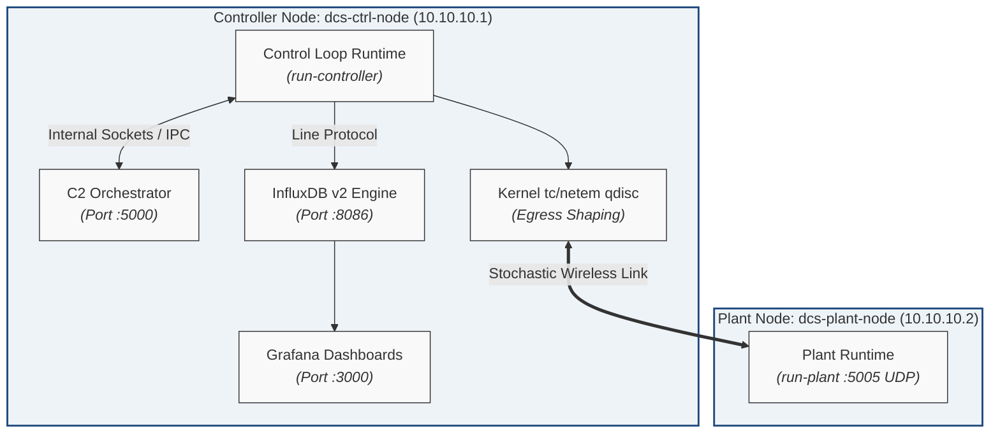

# Resilient Wireless Control: Hardening PID Loops against Network Jitter

A software-defined hardening and evaluation framework designed to quantify and mitigate the impact of non-deterministic wireless network dynamics (jitter, packet loss, and latency) on real-time Distributed Control Systems (DCS).


## Overview

Industrial IoT (IIoT) control loops operating over shared wireless channels (e.g., IEEE 802.11) face significant stability degradation from stochastic latency, packet loss, and channel contention. This framework enables:
- Programmatic injection of stochastic network impairments directly inside the Linux networking stack via kernel Traffic Control (`tc`) and Network Emulation (`netem`).
- Direct empirical benchmarking across Standard Discrete PID, Dead-Time Compensated Smith Predictor, and Predictive State-Estimating Resilient Controllers.
- Real-time sub-millisecond telemetry extraction into an InfluxDB v2/Grafana pipeline for stability boundary mapping and settling-time analysis.


## System Architecture

The testbed decouples real-time embedded control execution from human telemetry and supervisory orchestration across an isolated `10.10.10.0/24` subnet:


```

+---------------------------------------------------------------------------------+
| Controller Node: dcs-ctrl-node (10.10.10.1)                                     |
|                                                                                 |
|   +----------------------------+           +--------------------------------+   |
|   | Control Runtime (main.py)  | <=======> | C2 Orchestrator (c2_server.py) |   |
|   | (PID / Smith / Resilient)  |           | (REST API / Web Console :5000) |   |
|   +-------------+--------------+           +--------------------------------+   |
|                 | (via 127.0.0.1:8086)                                          |
|                 v                                                               |
|   +----------------------------+           +--------------------------------+   |
|   | InfluxDB v2 Engine (:8086) | <=======> | Grafana Visualizer (:3000)     |   |
|   +----------------------------+           +--------------------------------+   |
|                 |                                                               |
|                 +--- [ Linux Kernel tc/netem qdisc (eth0 / eth1 / wlan0) ]      |
+---------------------------------------+-----------------------------------------+
|
Isolated DCS Subnet (10.10.10.0/24 UDP)
|
+---------------------------------------+-----------------------------------------+
| Plant Node: dcs-plant-node (10.10.10.2)                                         |
|                                                                                 |
|   +-------------------------------------------------------------------------+   |
|   | Plant Runtime (plant_interface.py :5005 UDP)                            |   |
|   | - Simulated Mode: Continuous Aerodynamic ODE Twin (RK4 Integration)     |   |
|   | - Hardware Mode:  Physical GPIO/PWM Fan & I2C Distance Sensor Bus       |   |
|   +-------------------------------------------------------------------------+   |
+---------------------------------------------------------------------------------+

```



### Core Components

1. **Control Runtime Engine (`src/resilient_pid/controller/`)**: Discrete control laws supporting runtime switching between standard PID (`pid.py`), Smith Predictor dead-time cancellation (`smith_predictor.py`), and resilient observer estimation during dropouts (`resilient_pid.py`).

2. **Plant Abstraction Layer (`src/resilient_pid/plant/`)**: Polymorphic execution target supporting physical PWM/I2C peripheral drivers (`HardwarePlant`) or a 4th-Order Runge-Kutta continuous aerodynamic twin (`SimulatedPlant`).

3. **Telemetry Pipeline (`src/resilient_pid/telemetry/`)**: Asynchronous, non-blocking ingestion client streaming process variables ($PV$), setpoints ($SP$), control efforts ($u(t)$), and round-trip times ($RTT$) to InfluxDB v2.

4. **Command & Control Console (`src/resilient_pid/c2/`)**: REST API and operator web console for live setpoint adjustments, algorithm toggling, and trial coordination.


## Setup & Prerequisites

### Requirements

* **Target OS**: Debian 13 (Trixie) or Raspberry Pi OS (64-bit).

* **Kernel Modules**: `sch_netem`, `cls_u32` loaded into the active host/container kernel.

* **Runtimes**: Python 3.10+, Docker Engine 24.0+ (with Compose v2 plugin), and `iproute2`.

* **Privileges**: Elevated access (`sudo` or `CAP_NET_ADMIN`) for network queuing discipline manipulation.

> **Note on Virtual Testing:** To provision isolated Docker containers or Proxmox LXC testbeds with zero environment drift, refer to the [Mock Environment Guide](docs/development/mock_environment_guide.md).
> 

### 1. Workspace Provisioning

```bash
git clone https://github.com/jthurm11/resilient-wireless-pid.git
cd resilient-wireless-pid

python3 -m venv .venv
source .venv/bin/activate
pip install --upgrade pip
pip install -r requirements.txt
pip install -e .
```

### 2. Launch Telemetry Infrastructure

The time-series observability stack (InfluxDB v2 and Grafana) runs as containerized microservices managed via `scripts/infra/telemetry_stack.sh`:

```bash
# Provision InfluxDB v2 and Grafana
./scripts/infra/telemetry_stack.sh create

# Inspect container health and port bindings
./scripts/infra/telemetry_stack.sh status

# Validate telemetry pipeline with a synthetic smoke test
python3 scripts/test/telemetry_smoke_test.py
```

* To stop and purge telemetry containers: `./scripts/infra/telemetry_stack.sh destroy`


### 3. Verify Traffic Control Capabilities

Confirm that the kernel has loaded the network emulation scheduler and exposes netlink queueing discipline manipulation:

```bash
# Verify netem kernel module is loaded
sudo modprobe sch_netem

# Inspect active qdisc on inter-node DCS interface
tc qdisc show dev eth0
```


## Quickstart Trial

Follow this procedure to run an initial closed-loop test across the testbed:

### 1. Plant Node (`dcs-plant-node` @ 10.10.10.2)

Start the plant runtime daemon listening on UDP port `5005`:

```bash
# Explicitly select software twin when testing without physical hardware
run-plant --mode simulate --host 0.0.0.0 --port 5005
```

### 2. Controller Node (`dcs-ctrl-node` @ 10.10.10.1)

Identify your active egress interface pointing to the plant node:

* **Local Docker**: `IFACE="eth0"`

* **Proxmox LXC**: `IFACE="eth1"` (`vmbr1` isolated bridge)

* **Bare-Metal Pi**: `IFACE="wlan0"` (or `eth0`)


Apply stochastic network degradation to the egress interface:

```bash
# Inject 40ms baseline delay, ±10ms Gaussian jitter, and 2% packet loss
sudo tc qdisc add dev $IFACE root netem delay 40ms 10ms distribution normal loss 2%

# Verify transit latency to dcs-plant-node
ping -c 5 10.10.10.2
```

Launch the real-time controller runtime (automatically boots C2 orchestration with the UI enabled):

```bash
run-controller --mode baseline --setpoint 50.0 --enable-ui
```

* **C2 Operator UI:** Navigate to `http://localhost:5000` (or `http://<NODE1_IP>:5000`) to adjust setpoints or switch control algorithms on the fly.

* **Headless C2 Execution:** Update parameters programmatically via REST:

```bash
# Adjust for NODE1_IP as needed
curl -s -X POST http://127.0.0.1:5000/api/control \
  -H "Content-Type: application/json" \
  -d '{"algorithm": "smith", "setpoint": 65.0}'
```


* **Grafana Dashboard:** Navigate to `http://localhost:3000` (or `http://<NODE1_IP>:3000`) (`admin`/`admin`) to inspect real-time tracking error, control effort, and round-trip times ($RTT$).

* **InfluxDB Data Explorer:** Available at `http://localhost:8086` (`admin`/`adminpassword`).

### 3. Clear Network Emulation

Restore the interface to line-rate execution:

```bash
sudo tc qdisc del dev $IFACE root
```


## Attribution & Prior Art

This project is an advanced research continuation developed for the Master of Engineering Capstone at the University of Connecticut.

* **Preceding Implementation**: System concepts, architectural foundations, and hardware-in-the-loop insights originated from [`jthurm11/iot-real-time-scheduler-evaluation`](https://github.com/jthurm11/iot-real-time-scheduler-evaluation).


* **Physical Testbed Design**: Baseline physical plant and ball-floating topology adapted from the PingPongPID research testbed by [`Salzmann (2025)`](https://doi.org/10.1021/acs.jchemed.5c00528).


## License

This project is licensed under the terms of the [MIT License](LICENSE).
