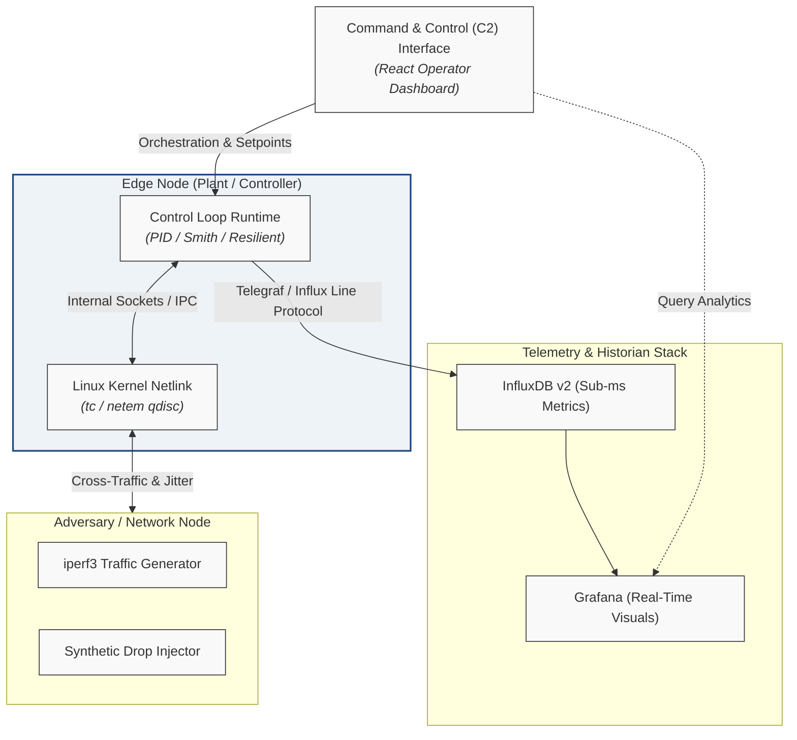

# Resilient Wireless Control: Hardening PID Loops against Network Jitter

A software-defined hardening and evaluation framework designed to quantify and mitigate the impact of non-deterministic wireless network dynamics (jitter, packet loss, and latency) on real-time Distributed Control Systems (DCS).

---

## Overview

Industrial IoT (IIoT) control loops operating over shared wireless channels (e.g., IEEE 802.11) face significant stability degradation from stochastic latency, packet loss, and channel contention. This framework enables:
- Programmatic injection of stochastic network impairments directly inside the Linux networking stack via kernel Traffic Control (`tc`) and Network Emulation (`netem`).
- Direct empirical benchmarking across Standard Discrete PID, Dead-Time Compensated Smith Predictor, and Event-Triggered/State-Estimating Resilient Controllers.
- Real-time sub-millisecond telemetry extraction into an InfluxDB/Grafana pipeline for stability boundary mapping and settling-time analysis.

---

## System Architecture

The testbed decouples real-time embedded control execution from human telemetry and data aggregation:


```
+-------------------------------------------------------------------------+
|                      Edge Node (Plant / Controller)                     |
|  +---------------------------+             +-------------------------+  |
|  |   Control Loop Runtime    |             |   Linux Kernel Netlink  |  |
|  | (PID / Smith / Resilient) | <---------> |   (tc / netem qdisc)    |  |
|  +-------------+-------------+             +------------+------------+  |
+----------------|----------------------------------------|---------------+
                 |                                        |
                 | Telegraf / Influx Line Protocol        | Cross-Traffic / Jitter
                 v                                        v
+-----------------------------------+        +----------------------------+
| Telemetry & Historian Stack       |        | Adversary / Network Node   |
| - InfluxDB v2 (Sub-ms Metrics)    |        | - iperf3 Traffic Generator |
| - Grafana (Real-Time Visuals)     |        | - Synthetic Drop Injector  |
+-----------------+-----------------+        +----------------------------+
                  ^
                  | Orchestration & Setpoints
+-----------------+-----------------+
| Command & Control (C2) Interface  |
| (React Operator Dashboard)        |
+-----------------------------------+
```


### Core Components
1. **Control Runtime Engine (`src/controller/`)**: Discrete control laws supporting runtime switching between standard PID, Smith Predictor dead-time cancellation, and zero-order hold state estimation.
2. **Kernel Emulation Scripts (`src/emulation/`)**: Automation utilities wrapping Linux `iproute2` to introduce deterministic latency, Gaussian/Pareto jitter, and burst drop patterns.
3. **Telemetry Pipeline (`src/telemetry/`)**: Non-blocking asynchronous ingestion pushing process variables ($PV$), setpoints ($SP$), control efforts ($u(t)$), and round-trip times ($RTT$) directly to InfluxDB.
4. **Command & Control Console (`src/c2/`)**: Web-based operator UI to trigger network stress profiles and adjust loop setpoints during active trials.

---

## Setup & Prerequisites

### Requirements
- **Host OS**: Debian 13 (Trixie) or Raspberry Pi OS (64-bit).
- **Kernel Modules**: `sch_netem`, `cls_u32` loaded into the active kernel.
- **Runtimes**: Python 3.10+, Docker Engine (for telemetry services), and `iproute2`.
- **Privileges**: Elevated privileges (`sudo` or `CAP_NET_ADMIN`) for network namespace manipulations.

> **Note on Virtual Testing:** To validate control routines and Linux `tc/netem` rules without physical hardware, refer to the [Proxmox LXC Mock Environment Guide](docs/development/proxmox_mock_environment.md).

### 1. Workspace Provisioning
```bash
git clone https://github.com/jthurm11/resilient-wireless-pid.git
cd resilient-wireless-pid

python3 -m venv .venv
source .venv/bin/activate
pip install --upgrade pip
pip install -e .
```

### 2. Launch Telemetry Infrastructure

The time-series observability stack runs as containerized microservices managed through a local automation wrapper. 

Execute the script with the `create` directive on the controller/historian node to provision the bridge network, spin up InfluxDB v2, configure access tokens, and deploy Grafana:

```bash
# Provision InfluxDB v2 and Grafana instances
bash ./scripts/infra/telemetry_stack.sh create
```

To view runtime container health or purge instances to perform a clean re-initialization:

```bash
# Inspect container health and port bindings
bash ./scripts/infra/telemetry_stack.sh status

# Stop and purge telemetry containers and networks
bash ./scripts/infra/telemetry_stack.sh destroy
```

### 3. Verify Traffic Control Capabilities

Confirm that the active Linux kernel has loaded the network emulation scheduler and exposes netlink queueing discipline manipulation:

```bash
# Verify netem kernel module is active
sudo modprobe sch_netem

# Inspect active qdisc on loopback or inter-node DCS interface
tc qdisc show dev lo
```

---

## Quickstart Trial

### 1. Plant node: Start the plant socket server 

```bash
run-plant --host 0.0.0.0 --port 5005
```

### 2. Controller node: Validate kernel network emulation, and InfluxDB telemetry pipeline

```bash
# Export authentication credentials
export INFLUXDB_URL="http://localhost:8086"
export INFLUXDB_TOKEN="testbed_secret_token_123"
export INFLUXDB_ORG="resilient_pid"
export INFLUXDB_BUCKET="wireless_pid_metrics"

# Inject synthetic network jitter (50ms base delay +/- 15ms Gaussian jitter)
sudo tc qdisc add dev lo root netem delay 50ms 15ms distribution normal

# Execute the automated calibration trial (500 steps @ dt=0.05s)
run-controller --mode baseline --target-host 10.10.10.2 --target-port 5005 --steps 500

# Tear down the kernel emulation rules
sudo tc qdisc del dev lo root
```

---

## Attribution & Prior Art

This project is an advanced research continuation developed for the Master of Engineering Capstone at the University of Connecticut.

* **Preceding Implementation**: System concepts, architectural foundations, and hardware-in-the-loop insights originated from [`jthurm11/iot-real-time-scheduler-evaluation`](https://github.com/jthurm11/iot-real-time-scheduler-evaluation).
* **Physical Testbed Design**: Baseline physical plant and ball-floating topology adapted from the PingPongPID research testbed by [`Salzmann (2025)`](https://doi.org/10.1021/acs.jchemed.5c00528).

## License

This project is licensed under the terms of the [MIT License](LICENSE).

---
