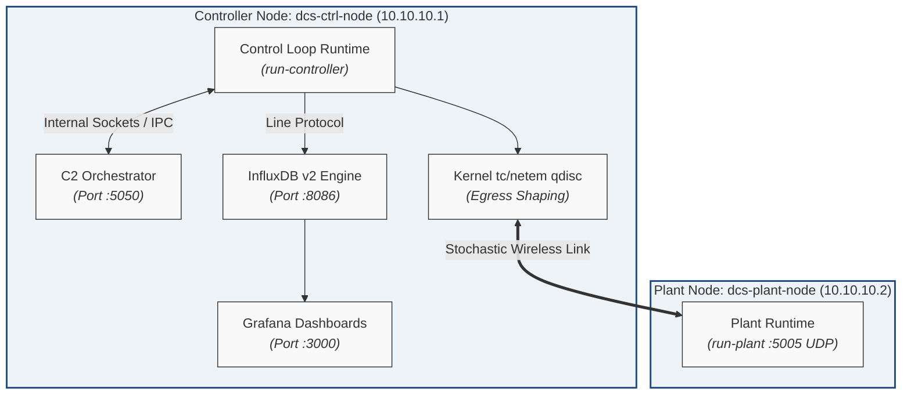

# Resilient Wireless Control: Hardening PID Loops against Network Jitter

[](https://github.com/jthurm11/resilient-wireless-pid/actions/workflows/ci.yml)

A software-defined hardening and evaluation framework designed to quantify and mitigate the impact of non-deterministic wireless network dynamics (jitter, packet loss, and latency) on real-time Distributed Control Systems (DCS).

## Overview

Industrial IoT (IIoT) control loops operating over shared wireless channels (e.g., IEEE 802.11) face stability degradation from stochastic transport delay, packet loss, and channel contention. This framework provides:
* Kernel-level injection of stochastic network impairments via Linux Traffic Control (`tc`) and Network Emulation (`netem`).
* Empirical benchmarking across Discrete PID, Dead-Time Compensated Smith Predictor, and Predictive State-Estimating Resilient Controllers.
* Real-time sub-millisecond telemetry extraction into an InfluxDB v2 and Grafana pipeline for stability boundary mapping.

## System Architecture

The testbed decouples real-time embedded control execution from supervisory orchestration across an isolated `10.10.10.0/24` subnet:


```mermaid
graph TD
    subgraph CtrlNode["Controller Node: dcs-ctrl-node (10.10.10.1)"]
        CLR["Control Loop Runtime<br/><i>(run-controller)</i>"]
        C2["C2 Orchestrator<br/><i>(Port :5050)</i>"]
        INF["InfluxDB v2 Engine<br/><i>(Port :8086)</i>"]
        GRA["Grafana Dashboards<br/><i>(Port :3000)</i>"]
        TC["Kernel tc/netem qdisc<br/><i>(Egress Shaping)</i>"]

        CLR <-->|Internal Sockets / IPC| C2
        CLR -->|Line Protocol| INF
        INF --> GRA
        CLR --> TC
    end

    subgraph PlantNode["Plant Node: dcs-plant-node (10.10.10.2)"]
        PLANT["Plant Runtime<br/><i>(run-plant :5005 UDP)</i>"]
    end

    TC <==>|Stochastic Wireless Link| PLANT

    classDef default fill:#f9f9f9,stroke:#333,stroke-width:1px;
    classDef nodeBox fill:#eef3f8,stroke:#1f497d,stroke-width:2px;
    class CtrlNode,PlantNode nodeBox;

```

### Core Modules

* **`resilient_pid.controller`**: Discrete algorithms supporting runtime switching between standard PID, Smith Predictor dead-time cancellation, and resilient observer estimation during dropouts.


* **`resilient_pid.plant`**: Polymorphic target executing physical PWM/I2C peripheral drivers (`HardwarePlant`) or a 4th-order Runge-Kutta continuous aerodynamic twin (`SimulatedPlant`).


* **`resilient_pid.telemetry`**: Non-blocking asynchronous ingestion pipeline writing process variables, setpoints, and round-trip times to InfluxDB v2.


* **`resilient_pid.c2`**: HTTP REST API and operator web console for runtime parameter adjustments and trial coordination.


## Prerequisites & Installation

* **Operating System**: Debian 13 (Trixie) or Raspberry Pi OS (64-bit Bookworm/Trixie).


* **Kernel Facilities**: `sch_netem`, `cls_u32`, and `i2c-dev` loaded in the host kernel.


* **Runtimes**: Python 3.10+, Docker Engine 24.0+ with Compose v2 plugin, and `iproute2`.


```bash
git clone https://github.com/jthurm11/resilient-wireless-pid.git
cd resilient-wireless-pid

python3 -m venv .venv
source .venv/bin/activate
pip install --upgrade pip
pip install -r requirements.txt
pip install -e .

```

## Infrastructure Orchestration

The repository provides two unified CLI managers for testbed deployment:

* **Virtual Testbeds (Docker / Proxmox LXC)**: Managed via `scripts/infra/virtual_manager.sh`. Automatically provisions bridges, container namespaces, and telemetry services. Refer to the [Virtual Environment Guide](https://www.google.com/search?q=docs/development/virtual_environment_guide.md) for complete hypervisor details.


* **Bare-Metal Hardware (Raspberry Pi Nodes)**: Managed via `scripts/infra/hardware_manager.sh`. Configures static secondary aliases on `wlan0:dcs`, deploys systemd units (`dcs-controller.service` or `dcs-plant.service`), and initializes diagnostic LED supervisor daemons.

```bash
# Provision physical Controller Node (Raspberry Pi Alpha)
sudo ./scripts/infra/hardware_manager.sh ctrl create

# Provision physical Plant Node (Raspberry Pi Beta)
sudo ./scripts/infra/hardware_manager.sh plant create

# Inspect node status or decommission
sudo ./scripts/infra/hardware_manager.sh status
sudo ./scripts/infra/hardware_manager.sh destroy

```

## Quickstart Trial

Follow this procedure to run an end-to-end closed-loop trial across the DCS link:

### 1. Launch Plant Runtime (`dcs-plant-node` @ 10.10.10.2)

Start the plant listener on UDP port `5005` (executed automatically when using `hardware_manager.sh` or Docker):

```bash
run-plant --mode simulate --host 0.0.0.0 --port 5005

```

### 2. Launch Controller & Observability (`dcs-ctrl-node` @ 10.10.10.1)

Ensure the telemetry stack is online and launch the baseline controller runtime:

```bash
# Initialize InfluxDB v2 and Grafana
./scripts/infra/telemetry_stack.sh create

# Launch real-time controller loop with operator UI
run-controller --mode baseline --setpoint 50.0 --enable-ui

```

* **Grafana Dashboards**: Access `http://127.0.0.1:3000` (`admin`/`admin`) for live tracking error, control effort, and transit latency.


* **C2 Web Console**: Access `http://127.0.0.1:5050` to adjust setpoints or switch control algorithms on the fly.


* **Headless C2 Dispatch**:
```bash
curl -s -X POST [http://127.0.0.1:5050/api/control](http://127.0.0.1:5050/api/control) \
  -H "Content-Type: application/json" \
  -d '{"algorithm": "smith", "setpoint": 65.0}'

```


### 3. Inject Stochastic Network Impairment

With the loop stabilized, inject delay, jitter, and packet loss onto the egress interface pointing to the plant node:

```bash
IFACE="wlan0"

# Inject 40ms baseline delay, ±10ms Gaussian jitter, and 2% packet loss
sudo tc qdisc add dev $IFACE root netem delay 40ms 10ms distribution normal loss 2%

# Verify active queue statistics and round-trip latency
tc -s qdisc show dev $IFACE
ping -c 5 10.10.10.2

# Restore interface to line-rate transmission
sudo tc qdisc del dev $IFACE root

```

---

## Attribution & Prior Art

This project is an advanced research continuation developed for the Master of Engineering Capstone at the University of Connecticut.

* **Preceding Implementation**: System concepts, architectural foundations, and hardware-in-the-loop insights originated from [`jthurm11/iot-real-time-scheduler-evaluation`](https://github.com/jthurm11/iot-real-time-scheduler-evaluation).


* **Physical Testbed Design**: Baseline physical plant and ball-floating topology adapted from the PingPongPID research testbed by [`Salzmann (2025)`](https://doi.org/10.1021/acs.jchemed.5c00528).


## License

This project is licensed under the terms of the [MIT License](LICENSE).
