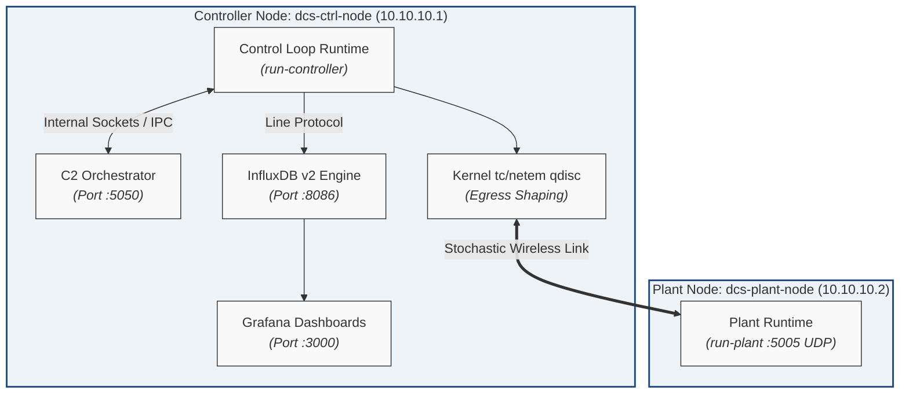

# Resilient Wireless Control: Hardening PID Loops against Network Jitter

[](https://github.com/jthurm11/resilient-wireless-pid/actions/workflows/ci.yml)

A software-defined hardening and evaluation framework designed to quantify and mitigate the impact of non-deterministic wireless network dynamics (jitter, packet loss, and latency) on real-time Distributed Control Systems (DCS).

## Overview

Industrial IoT (IIoT) control loops operating over shared wireless channels (e.g., IEEE 802.11) face stability degradation from stochastic transport delay, packet loss, and channel contention. This framework provides:
* Kernel-level injection of stochastic network impairments via Linux Traffic Control (`tc`) and Network Emulation (`netem`).
* Empirical benchmarking across Discrete PID, Dead-Time Compensated Smith Predictor, and Predictive State-Estimating Resilient Controllers.
* Real-time sub-millisecond telemetry extraction into an InfluxDB v2 and Grafana pipeline for stability boundary mapping.

## System Architecture

The testbed decouples real-time embedded control execution from supervisory orchestration across an isolated `10.10.10.0/24` subnet:


```mermaid
graph TD
    subgraph CtrlNode["Controller Node: dcs-ctrl-node (10.10.10.1)"]
        CLR["Control Loop Runtime<br/><i>(run-controller)</i>"]
        C2["C2 Orchestrator<br/><i>(Port :5050)</i>"]
        INF["InfluxDB v2 Engine<br/><i>(Port :8086)</i>"]
        GRA["Grafana Dashboards<br/><i>(Port :3000)</i>"]
        TC["Kernel tc/netem qdisc<br/><i>(Egress Shaping)</i>"]

        CLR <-->|Internal Sockets / IPC| C2
        CLR -->|Line Protocol| INF
        INF --> GRA
        CLR --> TC
    end

    subgraph PlantNode["Plant Node: dcs-plant-node (10.10.10.2)"]
        PLANT["Plant Runtime<br/><i>(run-plant :5005 UDP)</i>"]
    end

    TC <==>|Stochastic Wireless Link| PLANT

    classDef default fill:#f9f9f9,stroke:#333,stroke-width:1px;
    classDef nodeBox fill:#eef3f8,stroke:#1f497d,stroke-width:2px;
    class CtrlNode,PlantNode nodeBox;

```

### Core Components

* **Control Runtime Engine (`src/resilient_pid/controller/`)**: Discrete control laws supporting runtime switching between standard PID, Smith Predictor dead-time cancellation, and resilient observer estimation during dropouts.
* **Plant Abstraction Layer (`src/resilient_pid/plant/`)**: Polymorphic execution target supporting physical PWM/I2C peripheral drivers (`HardwarePlant`) or a 4th-order Runge-Kutta continuous aerodynamic twin (`SimulatedPlant`).
* **Telemetry Pipeline (`src/resilient_pid/telemetry/`)**: Asynchronous, non-blocking ingestion client streaming process variables, setpoints, control efforts, and round-trip times to InfluxDB v2.
* **Command & Control Console (`src/resilient_pid/c2/`)**: REST API and operator web console for live setpoint adjustments, algorithm toggling, and trial coordination.

### System Prerequisites

* **Target OS**: Debian 13 (Trixie) or Raspberry Pi OS (64-bit Bookworm/Trixie).
* **Kernel Modules**: `sch_netem`, `cls_u32`, and `i2c-dev` loaded into the active host kernel.
* **Runtimes**: Python 3.10+, Docker Engine 24.0+ (with Compose v2 plugin), and `iproute2`.
* **Privileges**: Elevated access (`sudo` or `CAP_NET_ADMIN`) for network queuing discipline manipulation.

---

## Deployment & Orchestration

The testbed is deployed and managed entirely through two automated lifecycle managers.

### Option A: Bare-Metal Hardware (Raspberry Pi Nodes)

Bootstrap directly on the physical nodes (automatically provisions hostnames, static `10.10.10.0/24` aliases, I2C/netem kernel overlays, status LEDs, and real-time systemd daemons):

```bash
# On Controller Node (Pi Alpha):
curl -fsSL https://raw.githubusercontent.com/jthurm11/resilient-wireless-pid/main/scripts/infra/hardware_manager.sh -o hardware_manager.sh
sudo bash hardware_manager.sh ctrl create

# On Plant Node (Pi Beta):
curl -fsSL https://raw.githubusercontent.com/jthurm11/resilient-wireless-pid/main/scripts/infra/hardware_manager.sh -o hardware_manager.sh
sudo bash hardware_manager.sh plant create

```

* Inspect active services, peripheral I2C buses, and aliases: `sudo ./hardware_manager.sh status`
* Decommission and restore default factory parameters: `sudo ./hardware_manager.sh destroy`

### Option B: Virtual Mock Testbed (Docker / Proxmox LXC)

For workstation emulation or hypervisor testing without physical hardware, use `virtual_manager.sh` (details in the [Virtual Environment Guide](docs/development/virtual_environment_guide.md)):

```bash
git clone https://github.com/jthurm11/resilient-wireless-pid.git
cd resilient-wireless-pid

# Automatically provisions Docker pods or Proxmox LXC containers CT 201/202
./scripts/infra/virtual_manager.sh create

```

* Inspect container status and health: `./scripts/infra/virtual_manager.sh status`
* Teardown testbed and purge volumes: `./scripts/infra/virtual_manager.sh destroy`

### Observability Health Check

The InfluxDB v2 and Grafana telemetry stack is automatically deployed via the lifecycle managers. To inspect container bindings or execute a synthetic smoke test:

```bash
# Inspect container health and port bindings
./scripts/infra/telemetry_stack.sh status

# Validate telemetry pipeline with a synthetic smoke test
python3 scripts/test/telemetry_smoke_test.py

```

---

## Closed-Loop Benchmark Trial

Once nodes are provisioned, the control loop, plant listener, and telemetry engines boot automatically in the background.

### 1. Supervisory Control & Visualization

* **Grafana Dashboards:** Navigate to `http://127.0.0.1:3000` (or `http://10.10.10.1:3000` on bare-metal) with credentials `admin`/`admin` to inspect real-time tracking error, control effort, and transit latency.
* **C2 Web Console:** Navigate to `http://127.0.0.1:5050` (or `http://10.10.10.1:5050`) to adjust setpoints or switch control algorithms on the fly.
* **Headless C2 Actuation:**
```bash
curl -s -X POST http://127.0.0.1:5050/api/control \
  -H "Content-Type: application/json" \
  -d '{"algorithm": "smith", "setpoint": 65.0}'

```

### 2. Inject Stochastic Impairments

From the controller node (`dcs-ctrl-node`), apply stochastic delay, jitter, and loss onto the egress DCS interface pointing to the plant:

```bash
IFACE="wlan0"

# Inject 40ms baseline delay, ±10ms Gaussian jitter, and 2% packet loss
sudo tc qdisc add dev $IFACE root netem delay 40ms 10ms distribution normal loss 2%

# Verify queue statistics and ping degradation
tc -s qdisc show dev $IFACE
ping -c 5 10.10.10.2

# Restore line-rate transmission
sudo tc qdisc del dev $IFACE root

```

---

## Attribution & Prior Art

This project is an advanced research continuation developed for the Master of Engineering Capstone at the University of Connecticut.

* **Preceding Implementation**: System concepts, architectural foundations, and hardware-in-the-loop insights originated from [`jthurm11/iot-real-time-scheduler-evaluation`](https://github.com/jthurm11/iot-real-time-scheduler-evaluation).
* **Physical Testbed Design**: Baseline physical plant and ball-floating topology adapted from the PingPongPID research testbed by [`Salzmann (2025)`](https://doi.org/10.1021/acs.jchemed.5c00528).

## License

This project is licensed under the terms of the [MIT License](LICENSE).
